# SuperHeroApi

This project was generated with [Angular CLI](https://github.com/angular/angular-cli) version 15.0.4.

## Development server and runing project

In the console, type the following line `'git clone   https://github.com/ManeDM/superHeroApi.git'`  to download the project

Use `npm install`  in the console to install the necessary Node.js packages for the project to work

Run `ng serve` for a dev server. Navigate to `http://localhost:4200/`. The application will automatically reload if you change any of the source files.

## Components Documentation

`Folder Structure `

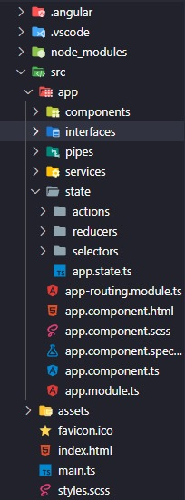

`Services  `

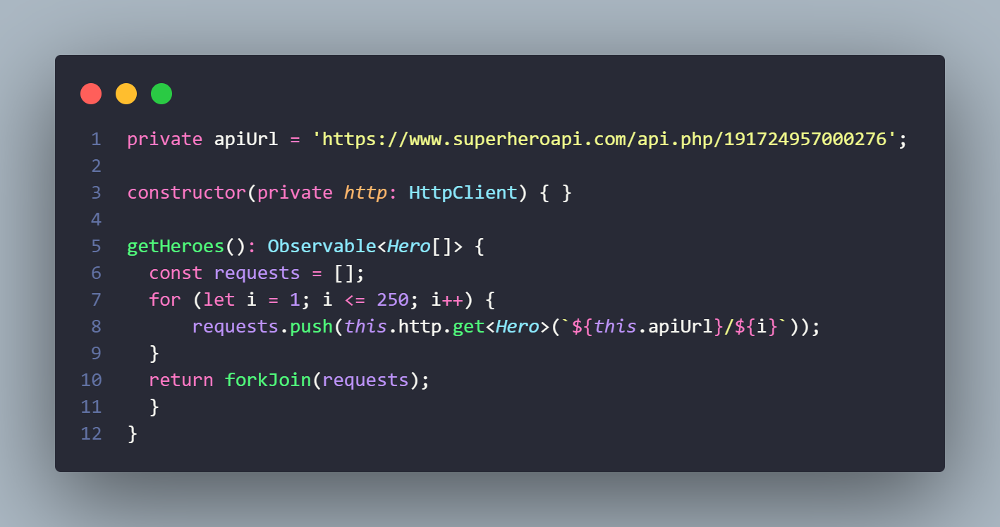

The current service uses the endpoint of superheroeapi, and through the function `getHeroes()` an observable is received as a parameter, which is modeled with the `Hero` interface. Then, the results are stored in the `Request` variable and a `for` loop is used to capture the information of all the heroes. Afterwards, using the `forkJoin` operator, the requests are combined in parallel and waits until all requests have completed before emitting the result.

`Variables  `

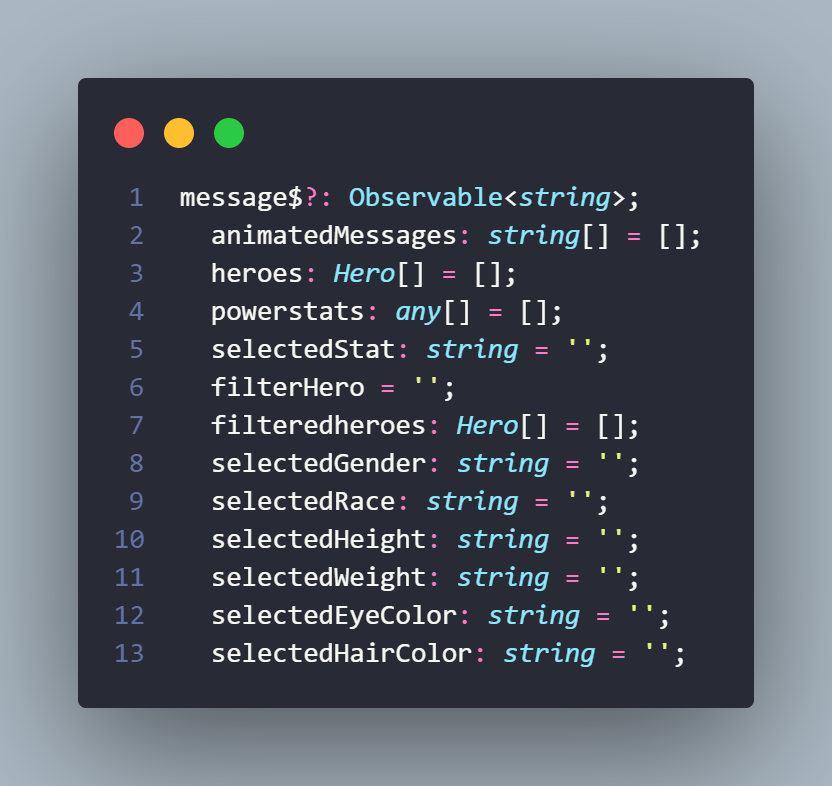

These are the variables that the different functions within the main component work with.

`Hero Interface  `

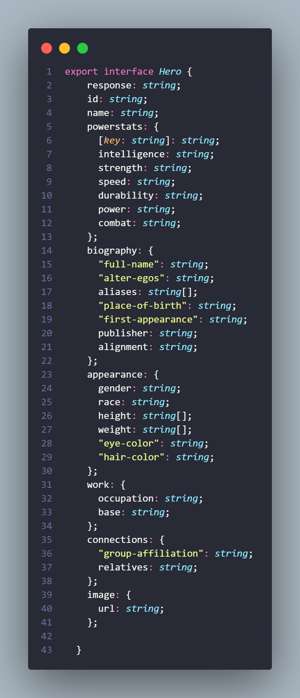

This interface models the data received in the JSON returned by the endpoint after making the GET request.

`Folder Structure `

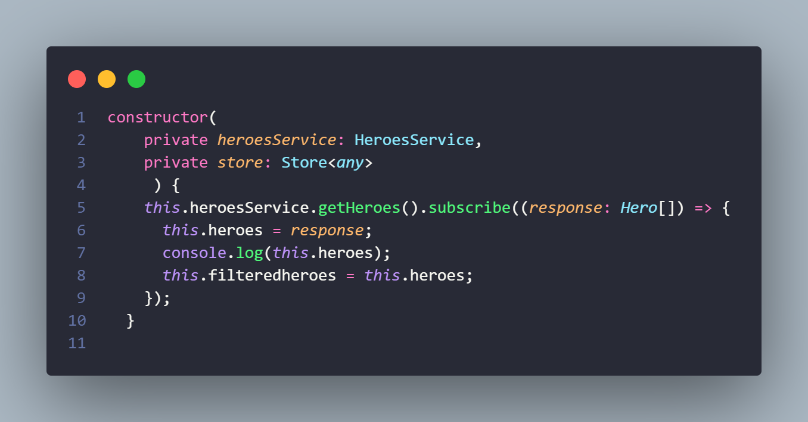

The present function located in the constructor allows, through the consumption of the previously described service and then subscribing to it, to receive as a response the JSON with the data, which is previously modeled by the `Hero` interface. `filteredHeroes` allows updating the information on the screen according to the activated filter.

`Pipes ` 

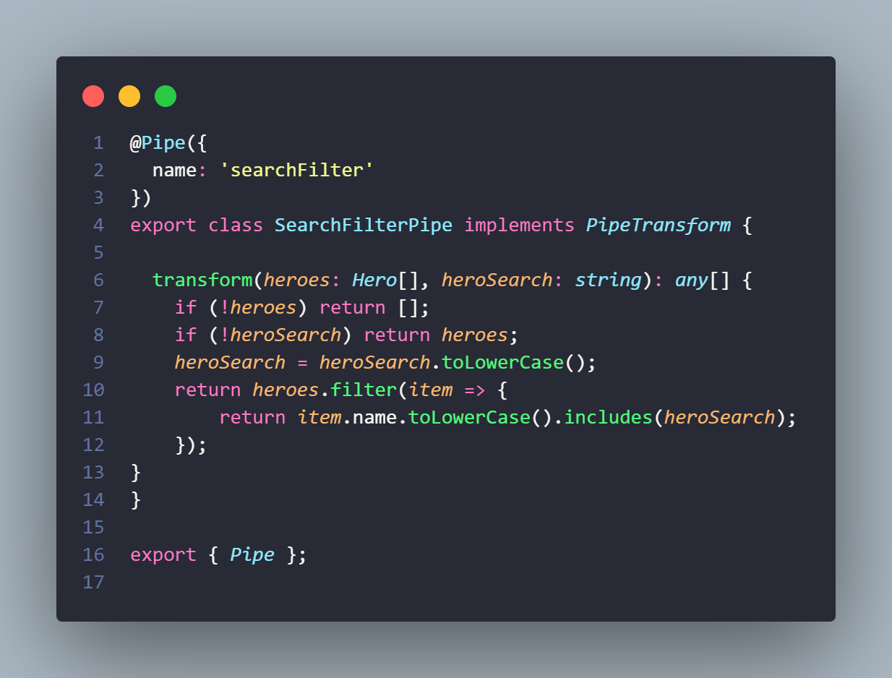

The pipe takes in an array of `Hero` objects and a search string as parameters, and returns an array of `Hero` objects that match the search string. If no search string is provided, it returns the original array of heroes. The search is case-insensitive and is done by checking if the hero's name includes the search string. This pipe can be used to filter and display a subset of heroes in a component's template.

`PowerStats Filter Functions `

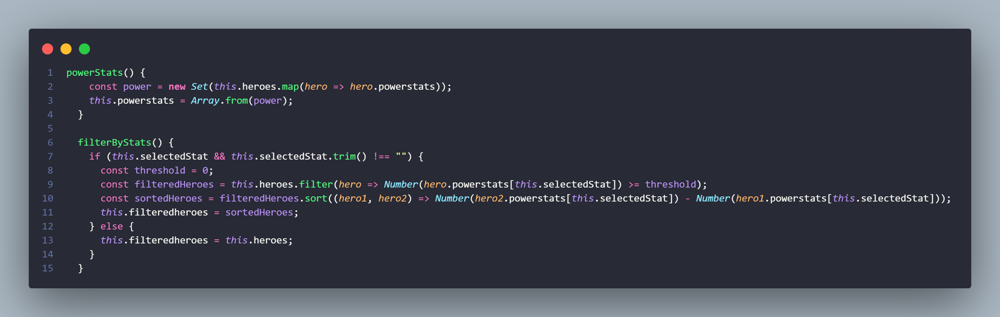

The `powerStats()` function creates a Set of powerstats by mapping over an array of `Hero` objects, and then converts it to an array. This function can be used to extract and display all unique powerstats from the `Hero` objects.

The `filterByStats()` function filters the `heroes` array based on the selected powerstat (`selectedStat`), and then sorts the resulting array by the powerstat's value. The filtered heroes are stored in the `filteredheroes` array. If no powerstat is selected, the `filteredheroes` array is set to the original `heroes` array. This function can be used to filter and sort the `Hero` objects based on their powerstats.

`Filters By Appearance`

The following are a couple of functions that demonstrate how the different appearance filters work. There will be two examples illustrated, but within the project there are a total of 5 filters, which are responsible for filtering by gender, hair color, eye color, weight, and height and race.

    `Filter By Gender`

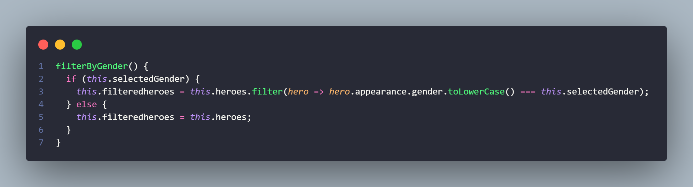

This function filters an array of heroes based on their gender. If a gender is selected, the function filters the array to only include heroes whose gender matches the selected gender. If no gender is selected, the function returns the original array of heroes.

    `Filters By Race`

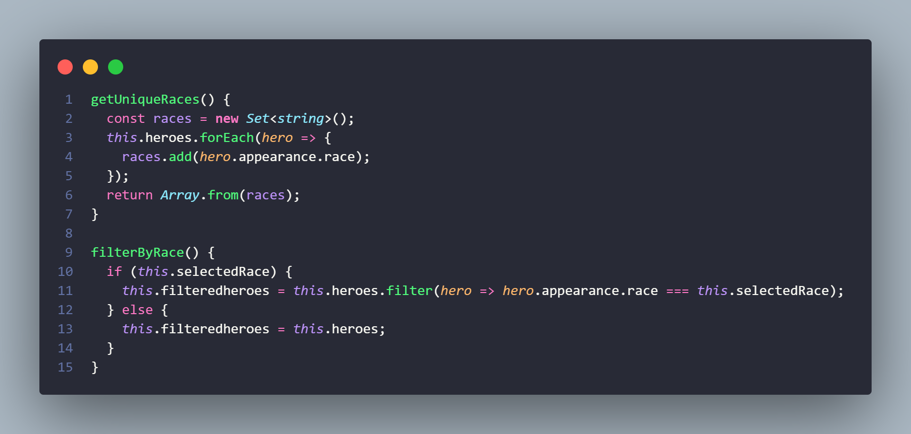

The function `getUniqueRaces()` creates a new `Set` object to store unique race values of heroes. It iterates over the array of heroes and adds each unique race to the set. Finally, it converts the set into an array and returns it.

The function `filterByRace()` filters the array of heroes based on the selected race. If a race is selected, it filters the array and returns only the heroes that have the selected race. If no race is selected, it returns the original array of heroes.

`NGRX implementation`

The following are 4 files that are responsible for controlling the state of a banner that appears on the main view of the project.

    `App State`

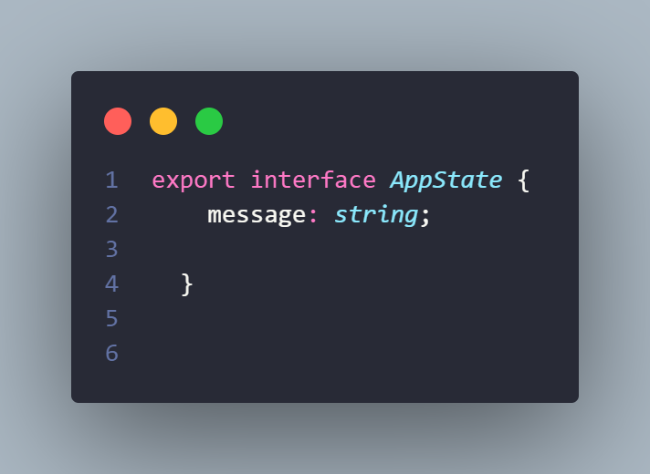

The `AppState` interface defines the state of the application and includes a single property `message`, which is a string that can be used to store any message or notification that needs to be displayed in the application.

    `Actions`

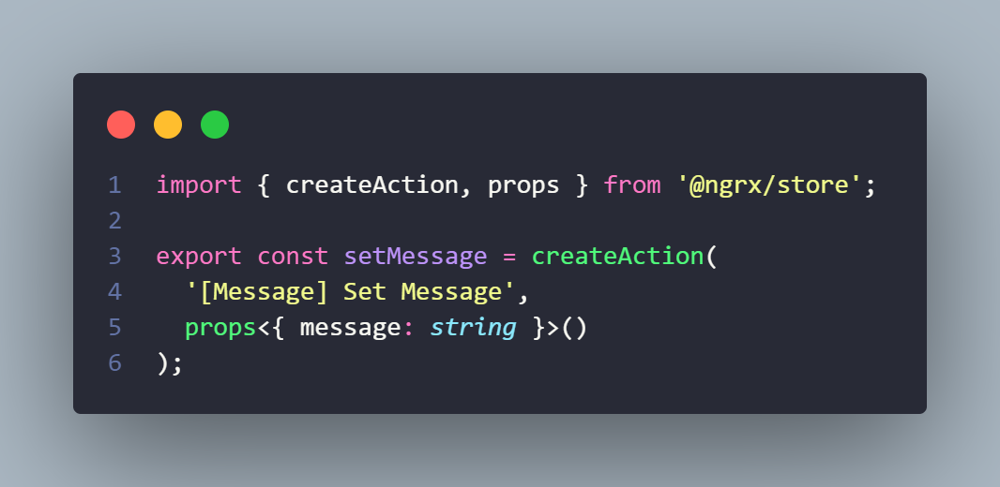

This action is related to the previous `app.state` interface. It creates an action that sets the `message` property of the app state. The action takes a `message` string as a parameter and is used to update the app state with a new message.

    `Reducers`

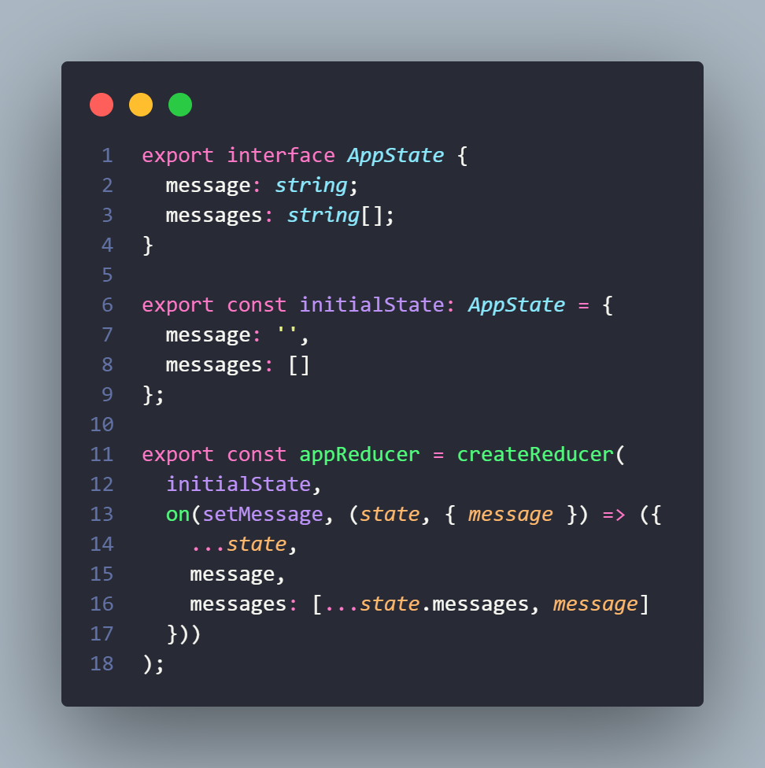

This is a reducer function that is responsible for managing the state of the application. It defines the initial state of the app which includes a message and an array of messages. It also creates a reducer using the `createReducer` function from the `@ngrx/store` library, which handles the `setMessage` action. When the `setMessage` action is dispatched, the reducer updates the `message` property of the state and adds the new message to the `messages` array. The new state is returned with the spread operator.

    `Selector`

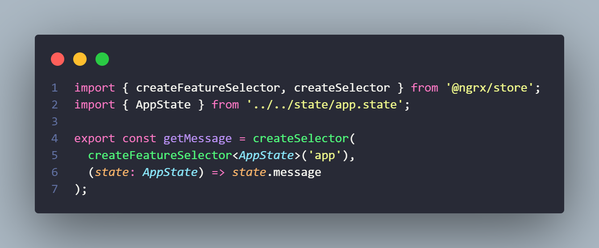

This file exports a selector function that retrieves the `message` property from the `AppState` state slice using the `createFeatureSelector` and `createSelector` functions provided by `@ngrx/store`. It allows components to access the `message` property from the store and use it in their templates or business logic.

    `State function`

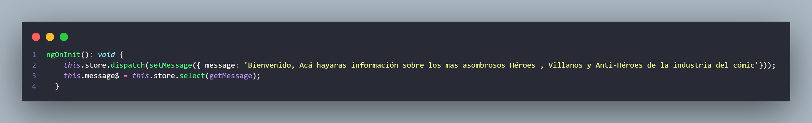

The `ngOnInit()` function is used to initialize the component and trigger some actions. In this case, it dispatches the `setMessage()` action with a welcome message and then subscribes to the `message$` observable which selects the `message` from the store using the `getMessage()` selector. This function is executed when the component is first created, allowing the message to be displayed in the view
